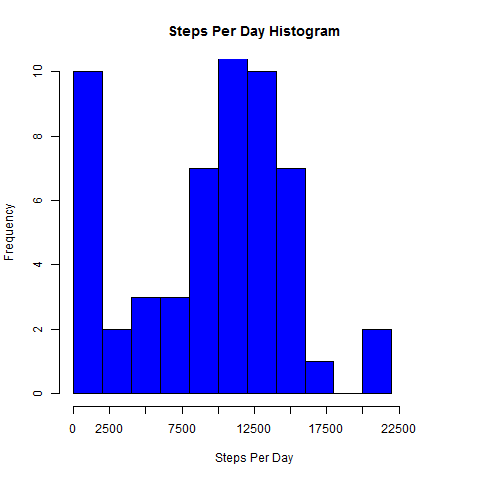
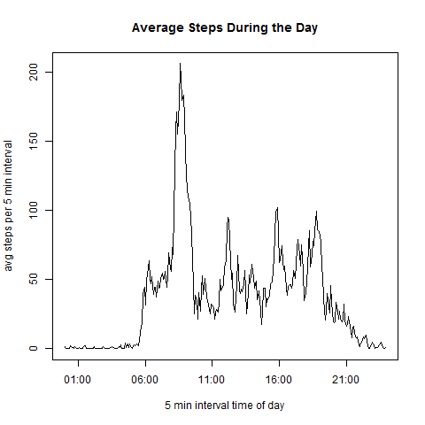
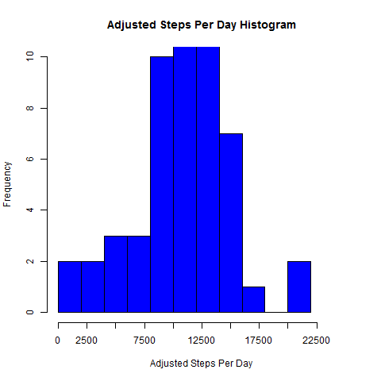
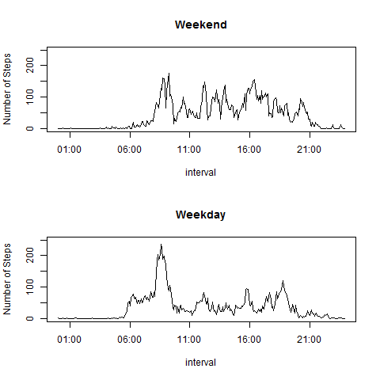

#Introduction

It is now possible to collect a large amount of data about personal movement using activity monitoring devices such as a Fitbit, Nike Fuelband, or Jawbone Up. These type of devices are part of the "quantified self" movement - a group of enthusiasts who take measurements about themselves regularly to improve their health, to find patterns in their behavior, or because they are tech geeks. But these data remain under-utilized both because the raw data are hard to obtain and there is a lack of statistical methods and software for processing and interpreting the data.

This assignment makes use of data from a personal activity monitoring device. This device collects data at 5 minute intervals through out the day. The data consists of two months of data from an anonymous individual collected during the months of October and November, 2012 and include the number of steps taken in 5 minute intervals each day.

#Data

The data for this assignment can be downloaded from the course web site:

*Dataset: Activity monitoring data [52K]

The variables included in this dataset are:

*steps: Number of steps taking in a 5-minute interval (missing values are coded as NA)
*date: The date on which the measurement was taken in YYYY-MM-DD format
*interval: Identifier for the 5-minute interval in which measurement was taken

The dataset is stored in a comma-separated-value (CSV) file and there are a total of 17,568 observations in this dataset.

## Loading and preprocessing the data

Below is the code to import the step activity data into R for processing

```{r}
  #Import Data
    Activity_Log <- data.frame()
    Activity_Log <- read.csv("activity.csv", na.strings = "NA")
```

In order to perform the analyses described in this report, the raw data fields provided needed to be transformed and additional fields were created from the data to supplement the analysis. The code for those transformations are shown below.

```{r}
  #tranform data for analysis
    Activity_Log$date = as.Date(Activity_Log$date, format = "%Y-%m-%d")
    Activity_Log$steps = as.numeric(Activity_Log$steps)
    Activity_Log$interval = as.numeric(Activity_Log$interval)
      #create time series interval time for analysis
      Activity_Log <-  cbind(Activity_Log,interval_hour = (Activity_Log$interval-Activity_Log$interval%%100)/100 ,interval_minute = Activity_Log$interval%%100)
      Activity_Log <-  cbind(Activity_Log,interval_time = paste(as.character(Activity_Log$interval_hour),":",as.character(Activity_Log$interval_minute), sep = '')) 
      Activity_Log$interval_time = as.POSIXct(Activity_Log$interval_time, format = "%H:%M")      
      #Add day of the week for further analysis
      Activity_Log <- cbind(Activity_Log, DoW = format(Activity_Log$date, format = "%A"))
      #Add weekend flag for further analysis
      Activity_Log <- cbind(Activity_Log, Weekend_Flag = "")
        #Update flag value
        Activity_Log <- within(Activity_Log, {
                Weekend_Flag = ifelse(Activity_Log$DoW %in% c("Saturday","Sunday"),"Y","N")
                })
```
        
## What is mean total number of steps taken per day?

The first part of this report will look at a distribution of the steps taken each day. The code below calculates the total number of steps taken per day.

```{r}
    #get total steps in each day
        Steps_per_Day <- tapply(Activity_Log$steps , Activity_Log$date, sum, na.rm = TRUE)
```

With that calculation the results can be examined in a histogram below to show visually this distribution of steps per day.

```{r}
      png("Figures\\01_Hist_Steps_per_Day.png")
      Step1_Hist <- hist(Steps_per_Day
           , col="blue"
           , xlab = "Steps Per Day"
           , main = "Steps Per Day Histogram"
           , xaxt = 'n'
           , yaxt='n'
           , xlim=c(0, 25000)
           , ylim=c(0,10)
           , breaks = 15
      )
      axis(1, at = seq(0, 22500, by = 2500))
      axis(2, at = seq(0,10, by = 2))   
      dev.off()
```    

 

The median and mean of this distribution are calculated and shown below.

```{r}
    #get mean and median steps per day    
      c(Median = median(Steps_per_Day),Mean = mean(Steps_per_Day))
```

## What is the average daily activity pattern?

In addtion to the steps per day this report also looks at the distribution of activity over the course of the day during the 5 minute intervals recorded in the data set.

Below is code that calculated the average number of steps in each interval period across all of the days included in the data set. 

```{r}
    #get average number of steps in each 5 min segment  
    Steps_per_Interval <- as.data.frame(tapply(Activity_Log$steps , Activity_Log$interval, mean, na.rm = TRUE), colnames("Steps_per_Interval"))
```

Below is the data preparation and graph to display the results of these acerages. This shows the average activity level at any point during the day from the data set provided.

```{r}
    #get the unique list of intervals
    Intervals <- as.data.frame(unique(unlist(Activity_Log$interval_time)))
    
    #Create table with intervals and their average steps 
    Intervals_and_Avg_Steps <- as.data.frame(cbind(Intervals,Steps_per_Interval))
    colnames(Intervals_and_Avg_Steps) <- c("interval", "avg_Steps")

    png("Figures\\02_Avg_Interval_Steps.png")
    plot(Intervals_and_Avg_Steps$interval, Intervals_and_Avg_Steps$avg_Steps
         , col = "black"
         , type = "l"
         , xlab = "5 min interval time of day"
         , ylab = "avg steps per 5 min interval"
         , main = "Average Steps During the Day"
         #, xaxt = 'n'
         #, yaxt='n'
         #, xlim=c(min(Intervals_and_Avg_Steps$interval),max(Intervals_and_Avg_Steps$interval))
         #, ylim=c(0,10)
         )
    dev.off()
```



The 5-minute interval containing the maximum number is found using the code below.

```{r}
    #Find the max average steps    
    Max_Avg_Steps <- max(Intervals_and_Avg_Steps$avg_Steps)
    
    #find interval with the maximum average steps
    subset(Intervals_and_Avg_Steps, Max_Avg_Steps==Intervals_and_Avg_Steps$avg_Steps, select = c(interval, avg_Steps))
```

## Imputing missing values

The provided data set has a significant number of 'NA' values populated in the steps column. Currently these values would be treated as zeros when looking at daily distributions causing the distribution to be skewed towards zero. 

In order to compensate for the skewed data set this report looks at the distrubution when simulated values have replaced those 'NA' values. In this case the 'NA' Values will be replaced with the average value of records that share the same interval from the same day of the week. The assumption being that the activity should be similar on the same days at the same time if the person whose activity is being tracked sticks to a consisten schedule throughout the week and during the day.

The code below splits the data set into "Complete"" and "NA" tables to begin this analysis.

```{r}
    #Complete records
    Activity_Log_Complete <- Activity_Log[complete.cases(Activity_Log),]
    #records with NAs
    Activity_Log_NA <- Activity_Log[!complete.cases(Activity_Log),]
    nrow(Activity_Log_NA)
```

Then the needed averages are taken from the "Complete" table and then applied to the "NA" table as shown below using SQL steps.

```{r}
    library(sqldf)
    #Using SQL
      #create averages from complete data
      Steps_per_interval_DoW <- sqldf('select 
                interval
              , DoW
              , sum(steps)/count(steps) as Avg_Steps_Interval_DoW 
            from Activity_Log_Complete 
            group by interval, DoW')
  
      #add values to the Activity_Log_NA table
      Activity_Log_NA <- sqldf(' select 
              b.Avg_Steps_Interval_DoW as steps
              ,a.date 
              ,a.interval 
              ,a.interval_hour
              ,a.interval_minute 
              ,a.interval_time
              ,a.DoW
              ,a.Weekend_Flag
              from Activity_Log_NA as a 
              left join Steps_per_interval_DoW as b
                on a.DoW = b.DoW 
                and a.interval = b.interval
            ')
```

The 2 data sets are then combined to create an adjusted data set to compare to the raw data.

```{r}
      #create adjusted data set including complete records and new NAs
      Activity_Log_Adjusted <- data.frame()
      Activity_Log_Adjusted <- rbind(Activity_Log_Complete,Activity_Log_NA)    
```


The same steps from earlier in the report are then followed with the adjusted data set to create the same histogram and calculate the mean and median total steps taken per day.

As you can see the lower values of the distribution have shifted causing a greater concentration of values in the middle of the range of total steps. The mean and median have increased as would be expected with replacing values of zero with an average value when calculating the total steps in a day.

```{r}
    #get total steps in each day
      Adj_Steps_per_Day <- tapply(Activity_Log_Adjusted$steps , Activity_Log_Adjusted$date, sum, na.rm = TRUE)
      
    #Histogram
      png("Figures\\03_Hist_Adj_Steps_per_Day.png")
      Step3_Hist <- hist(Adj_Steps_per_Day
                         , col="blue"
                         , xlab = "Adjusted Steps Per Day"
                         , main = "Adjusted Steps Per Day Histogram"
                         , xaxt = 'n'
                         , yaxt='n'
                         , xlim=c(0, 25000)
                         , ylim=c(0,10)
                         , breaks = 15
      )
      axis(1, at = seq(0, 22500, by = 2500))
      axis(2, at = seq(0,10, by = 2))   
      dev.off()
      
      #get mean and median steps per day    
      c(Median = median(Adj_Steps_per_Day),Mean = mean(Adj_Steps_per_Day))
```



## Are there differences in activity patterns between weekdays and weekends?

The report also looks at the weekend and weekday activity separately to look for any differences. In the initial data prep step a weekend flag was created (see the "Loading and preprocessing the data" section of this report). This flag was then used to separate weekend and weekday data into separate tables as shown below.

```{r}
      Weekend_Data <- subset(Activity_Log_Adjusted, subset = Activity_Log_Adjusted$Weekend_Flag %in% c('Y'))
      Weekday_Data <- subset(Activity_Log_Adjusted, subset = Activity_Log_Adjusted$Weekend_Flag %in% c('N'))
```

additional data steps shown below were performed to prepare the weekend and weekday data for comparison in a time series.

```{r}
      #Weekend data prep for graph
          #get average number of steps in each 5 min segment  
          Weekend_Steps_per_Interval <- as.data.frame(tapply(Weekend_Data$steps , Weekend_Data$interval, mean, na.rm = TRUE), colnames("Steps_per_Interval"))
          
          #get the unique list of intervals
          Weekend_Intervals <- as.data.frame(unique(unlist(Weekend_Data$interval_time)))
          
          #Create table with intervals and their average steps 
          Weekend_Intervals_and_Avg_Steps <- as.data.frame(cbind(Weekend_Intervals,Weekend_Steps_per_Interval))
          colnames(Weekend_Intervals_and_Avg_Steps) <- c("interval", "avg_Steps")
    
      #Weekday data prep for graph
          #get average number of steps in each 5 min segment  
          Weekday_Steps_per_Interval <- as.data.frame(tapply(Weekday_Data$steps , Weekday_Data$interval, mean, na.rm = TRUE), colnames("Steps_per_Interval"))
          
          #get the unique list of intervals
          Weekday_Intervals <- as.data.frame(unique(unlist(Weekday_Data$interval_time)))
          
          #Create table with intervals and their average steps 
          Weekday_Intervals_and_Avg_Steps <- as.data.frame(cbind(Weekday_Intervals,Weekday_Steps_per_Interval))
          colnames(Weekday_Intervals_and_Avg_Steps) <- c("interval", "avg_Steps")
```

Below is the time series comparison of average intervals for weekend and weekday data.

```{r}    
      png("Figures\\04_Weekend_Weekday_Comp.png")    
      par(mfcol = c(2,1))
      #weekend plot
      plot(Weekend_Intervals_and_Avg_Steps$interval, Weekend_Intervals_and_Avg_Steps$avg_Steps
           , col = "black"
           , type = "l"
           , xlab = "interval"
           , ylab = "Number of Steps"
           , main = "Weekend"
           , ylim=c(0,250)
      )
      
      #weekday plot
      plot(Weekday_Intervals_and_Avg_Steps$interval, Weekday_Intervals_and_Avg_Steps$avg_Steps
           , col = "black"
           , type = "l"
           , xlab = "interval"
           , ylab = "Number of Steps"
           , main = "Weekday"
           , ylim=c(0,250)
      )
      dev.off()
```


